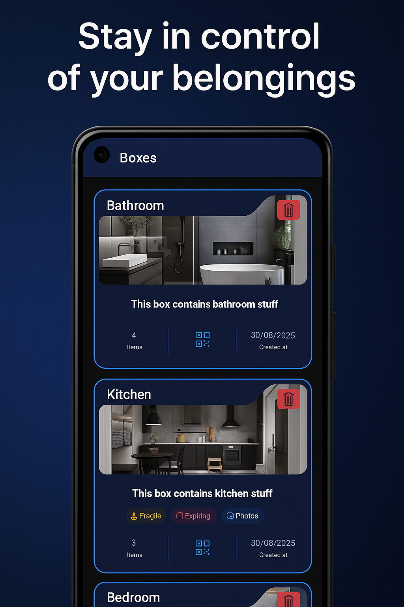
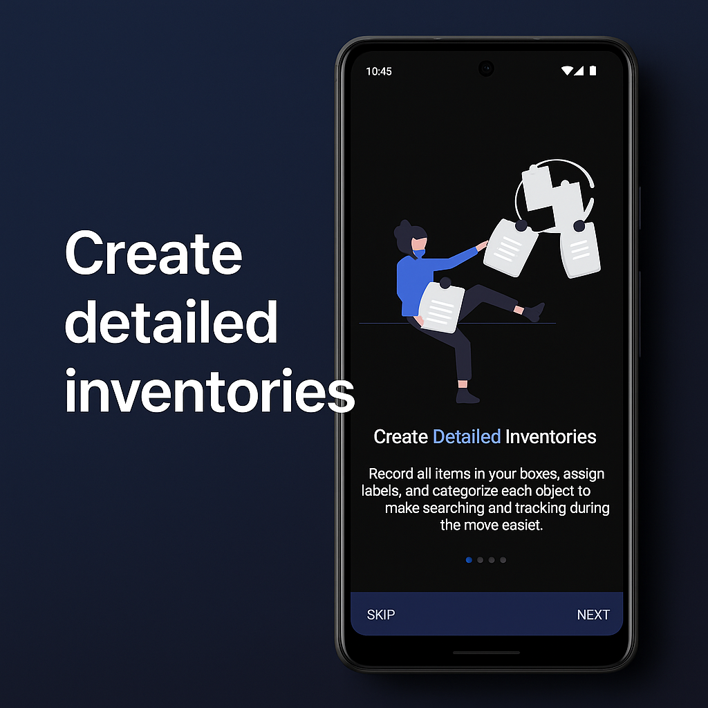

# QRganize - Moving Organization Application

<div align="center">
  
</div>

## Description

QRganize is a comprehensive mobile application that helps organize moving processes by using QR codes to identify the contents of boxes.

## Screenshots

<div align="center">
  
  
  
</div>

## Completed Features

### Backend (NestJS)

- Authentication and user management
- Complete CRUD for boxes with validation
- Complete CRUD for items inside boxes
- Automatic generation of unique QR codes
- Documented REST API
- File and image handling
- MySQL database with TypeORM

### Frontend (Ionic Angular)

- Responsive mobile interface
- Complete box management
- Complete item management
- Functional QR code scanner
- Advanced box search
- Camera integration for photos
- Tab navigation
- Modals for create/edit
- Toast notifications

## Upcoming Improvements

### Additional Features

1. **Item Categories**: Classify objects by type (clothing, books, etc.)
2. **Moving States**: Mark boxes as packed, in transit, unpacked
3. **Locations**: Assign origin and destination rooms
4. **Moving Checklist**: Pending tasks list
5. **Share Boxes**: Collaboration between users
6. **Export/Import**: Data backup
7. **Statistics**: Dashboard with moving metrics
8. **Push Notifications**: Reminders and alerts

### UX/UI

1. **Dark Theme**: Dark mode
2. **Advanced Filters**: Multiple search criteria
3. **Tutorial**: Interactive onboarding

## Installation and Usage

### Prerequisites

- Node.js 18+
- MySQL 8+
- Docker
- Angular CLI
- Ionic CLI
- Git

### Getting Started

```bash
# Clone services repositories
npm run pull

# Install dependencies and build
npm run prepare

# Start backend service and db
npm run start
```

## Technologies Used

### Backend

- NestJS
- TypeORM
- MySQL
- JWT
- class-validator
- qrcode

### Frontend

- Ionic 7
- Angular 17
- Capacitor
- RxJS
- TypeScript

## Contributing

Contributions are welcome! Please feel free to submit a Pull Request.

## License

This project is licensed under the MIT License - see the LICENSE file for details.

---

_Developed to facilitate organized and stress-free moving_
